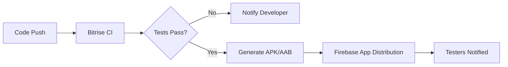

# CI/CD Infrastructure: Bitrise & Firebase App Distribution

This document outlines the purpose and integration of **Continuous Integration (CI)** and **Continuous Deployment (CD)** using **Bitrise** and **Firebase** for Android development.

## 1. Core Purpose

The primary goal of CI/CD is to automate the manual steps of building, testing, and distributing an app, ensuring that the development cycle is fast, reliable, and transparent.

### Continuous Integration (CI) - Powered by Bitrise
*   **Automated Builds**: Every time code is pushed to the repository, Bitrise automatically triggers a build to ensure the code compiles.
*   **Quality Assurance**: Runs unit tests and UI tests automatically on every Pull Request (PR) to catch bugs before they merge.
*   **Consistency**: Eliminates "it works on my machine" issues by building in a clean, standardized environment.

### Continuous Deployment (CD) - Powered by Firebase App Distribution
*   **Beta Distribution**: Automatically delivers the latest build to QA testers and stakeholders without waiting for Play Store reviews.
*   **Tester Management**: Easily manage different groups (e.g., "Internal Devs", "QA Team", "Beta Users").
*   **Release Tracking**: Centralized dashboard to see which version is currently being tested and by whom.

---

## 2. How They Work Together

The Bitrise → Firebase pipeline creates a "seamless flow" from code to tester:

1.  **Bitrise** handles the heavy lifting: running Gradle tasks, managing signing keys, and assembling the binaries.
2.  **Firebase** handles the distribution: it acts as a private app store for your internal team.

---

## 3. Key Integration Components

To connect these two, the following are typically required:

### A. Authentication
There are two main ways Bitrise communicates with Firebase:
1.  **Service Account JSON (Recommended)**: A Google Cloud service account with "Firebase App Distribution Admin" permissions. This is the most secure and modern method.
2.  **Firebase Token**: A legacy CLI-generated token. Easier to set up initially but less secure/flexible than service accounts.

### B. Bitrise Workflow Step
Bitrise provides a dedicated "Firebase App Distribution" step that requires:
*   **App ID**: Found in Firebase Project Settings.
*   **Tester Groups**: String comma-separated (e.g., `qa-team, managers`).
*   **Release Notes**: Usually pulled from the git commit message or a dedicated file.

---

## 4. Comparison: Bitrise vs. GitHub Actions

| Feature | Bitrise | GitHub Actions |
| :--- | :--- | :--- |
| **Setup** | Mobile-first, visual workflow editor. Very easy. | Config-heavy (YAML). Requires more "plumbing". |
| **Virtual Machines** | Specialized MacOS/Android environments pre-installed. | General-purpose runners. |
| **Cost** | Can be expensive for larger teams. | Often "free" for public repos or included in GH Enterprise. |
| **Ecosystem** | Thousands of mobile-specific "Steps" (e.g., Step for Google Play, App Distribution). | "Actions" maintained by the community; very flexible but generic. |

## 5. Summary
Using **Bitrise** and **Firebase** together serves to **remove human error** from the release process. Developers focus on coding, while the infrastructure handles the verification and delivery of the software to the right people.
