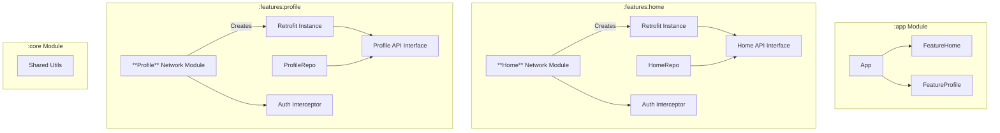
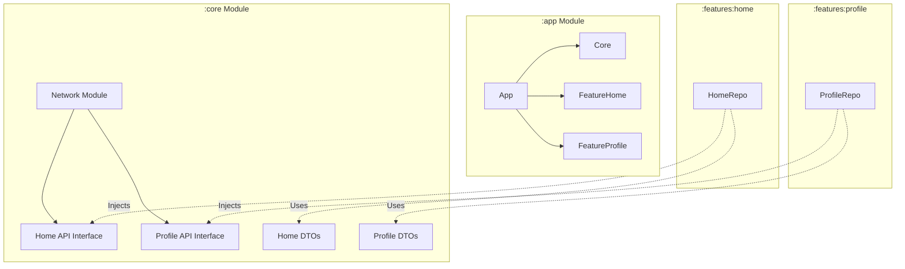
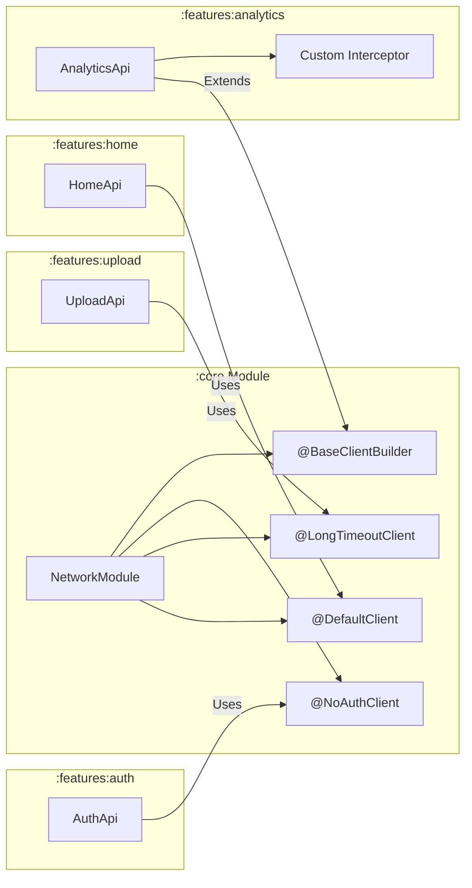

# Retrofit Client Architecture: Core vs. Feature Module

This document details the architectural implications of where to place the Retrofit Client configuration in a modular Android application.

## Overview of Scenarios

We are comparing two primary approaches for handling the **Retrofit Client Configuration** (the `OkHttpClient`, `Retrofit.Builder`, `BaseUrl`, Interceptors, etc.):

1.  **Scenario A: Centralized Core Configuration (Recommended)**
    *   **Core Module**: Configures and provides the single `Retrofit` instance.
    *   **Feature Modules**: define their own API interfaces (`HomeApi`, `ProfileApi`) and use the Core's `Retrofit` instance to create them.
2.  **Scenario B: Feature-Isolated Configuration**
    *   **Feature Modules**: Each feature configures and creates its own `Retrofit` and `OkHttpClient` instances completely independently.
3.  **Scenario C: Monolith Core (The "God" Module)**
    *   **Core Module**: Contains the Retrofit configuration **AND** all API interfaces for every feature in the app.

---

## Deep Dive Comparison

| Feature | Scenario A: Centralized (Core) | Scenario B: Isolated (Feature) | Scenario C: Monolith (Core) |
| :--- | :--- | :--- | :--- |
| **Consistency** | **High.** All requests share the same timeouts, auth headers, and logging logic. | **Low.** Easy to forget an auth interceptor or use different timeout values in one feature vs another. | **High.** Same as Scenario A. |
| **Memory Usage** | **Efficient.** 1 `OkHttpClient` instance involves 1 connection pool shared across the app. | **High.** Multiple `OkHttpClient` instances mean multiple connection pools, separate thread pools, and more resource usage. | **Efficient.** Uses single instance. |
| **Separation of Concerns** | **Excellent.** Core handles *infrastructure* (transport), Features handle *business logic* (endpoints). | **Mixed.** Features are burdened with infrastructure setup code. | **Poor.** Core knows about specific business logic logic (e.g., "Add Item to Cart"). |
| **Build Speed (Incremental)** | **Fast.** Changing the `HomeApi` only recompiles the Home module. | **Medium.** Changing config recompiles that feature. | **Slow.** Changing `HomeApi` in Core may force recompilation of *every* module that depends on Core (which is usually all of them). |
| **Feature Independence** | **High.** Features are decoupled from each other, only dependent on a generic network provider. | **Total.** Features can be run in complete isolation without a Core network module. | **Low.** Features are tightly coupled to the central Core for specific data needs. |

---

## Detailed Analysis

### Scenario A: Centralized Core (The Industry Standard)

This is the standard for modern modular architectures (Clean Architecture).

*   **pros**:
    *   **DRY (Don't Repeat Yourself):** You write the Authentication Interceptor once in `core`. It automatically applies to Home, Profile, and Settings networking.
    *   **Resource Management:** Sharing the underlying `OkHttpClient` ensures efficient socket reuse and connection pooling.
*   **cons**:
    *   Features have a dependency on `:core` (though this is standard in almost all apps).

### Scenario B: Feature-Isolated (The "Microservice" Approach)

Rarely used within a single Android binary, but conceptually similar to microservices.

*   **pros**:
    *   If "Chat" needs WebSockets and a 60s timeout, but "Feed" needs REST and a 10s timeout, they don't fight over a shared config.
*   **cons**:
    *   **Auth Nightmare:** You have to sync the user's Session Token across multiple distinct network clients.
    *   **Bloat:** Significant code duplication for basic setup (Gson, logging, logging interceptors).

### Scenario C: Monolith Core (The "Legacy" Approach)

Often found in apps transitioning from single-module to multi-module.

*   **pros**:
    *   "Easy" to find code—everything is in one big folder.
*   **cons**:
    *   **Dependency Hell:** If `HomeApi` needs a `HomeData` model, that model must also be in Core. Slowly, your entire app logic leaks into Core to satisfy type dependencies, defeating the purpose of modularization.

---

## Architectural Visualization

### Mermaid Diagram: Scenario A (Recommended)

```mermaid
graph TD
    subgraph ":app Module"
        App --> Core
        App --> FeatureHome
        App --> FeatureProfile
    end

    subgraph ":core Module"
        CoreNetwork[Network Module<br/>(Provides Retrofit Instance)]
        Auth[Auth Interceptor]
        CoreNetwork --> Auth
    end

    subgraph ":features:home"
        HomeRepo --> HomeApi[Home API Interface]
        HomeApi -.->|Uses shared instance| CoreNetwork
    end

    subgraph ":features:profile"
        ProfileRepo --> ProfileApi[Profile API Interface]
        ProfileApi -.->|Uses shared instance| CoreNetwork
    end
```

### Mermaid Diagram: Scenario B (Feature-Isolated)

In this scenario, every feature builds its own HTTP client. Note the duplication of `Auth` and `Network`.



### Mermaid Diagram: Scenario C (Monolith Core)

In this scenario, the `core` module becomes bloated. Features are thin but `core` knows too much about feature-specifics.



### Key Takeaway

**Place the Client in Core. Place the Interfaces in Features.**

1.  **Core** provides the `Retrofit` **OBJECT**.
2.  **Feature** defines the `Interface` **CLASS**.
3.  dependency injection (DI) combines them: `retrofit.create(FeatureApi::class.java)`.

---

## Advanced: Feature Customization Strategies

While Core owns the network configuration, features often need customization. Here are three strategies for maximum flexibility:

### Strategy 1: Qualifier-Based Clients

**Use Case:** Features need different configurations (timeouts, auth, etc.)

Core provides multiple pre-configured clients with qualifiers:

```kotlin
// In :core - Define qualifiers
@Qualifier annotation class DefaultClient      // 30s timeout, with auth
@Qualifier annotation class LongTimeoutClient  // 60s timeout, with auth  
@Qualifier annotation class NoAuthClient       // 30s timeout, no auth

// In :core - NetworkModule.kt
@Provides @DefaultClient
fun provideDefaultClient(): OkHttpClient { ... }

@Provides @LongTimeoutClient  
fun provideLongTimeoutClient(): OkHttpClient { ... }

// In :features:upload - Uses long timeout
@Provides
fun provideUploadApi(@LongTimeoutClient retrofit: Retrofit): UploadApi {
    return retrofit.create(UploadApi::class.java)
}

// In :features:auth - Uses no-auth client
@Provides
fun provideAuthApi(@NoAuthClient retrofit: Retrofit): AuthApi {
    return retrofit.create(AuthApi::class.java)
}
```

### Strategy 2: Builder Provider Pattern

**Use Case:** Features need to add custom interceptors while inheriting base config.

```kotlin
// In :core - Provide a pre-configured builder
@Provides
@BaseClientBuilder
fun provideBaseBuilder(): OkHttpClient.Builder {
    return OkHttpClient.Builder()
        .connectTimeout(30, SECONDS)
        .addInterceptor(authInterceptor)
        .addInterceptor(loggingInterceptor)
    // Note: .build() is NOT called - features complete it
}

// In :features:analytics - Adds custom interceptor
@Provides
fun provideAnalyticsClient(
    @BaseClientBuilder builder: OkHttpClient.Builder
): OkHttpClient {
    return builder
        .addInterceptor(AnalyticsTrackingInterceptor())  // Feature-specific
        .build()
}
```

### Strategy 3: Interceptor Composition

**Use Case:** Features register their own interceptors to the shared client.

```kotlin
// In :core - Define interface for feature interceptors
interface FeatureInterceptorProvider {
    fun getInterceptors(): List<Interceptor>
}

// In :features:cache - Implements provider
class CacheInterceptorProvider : FeatureInterceptorProvider {
    override fun getInterceptors() = listOf(CacheInterceptor())
}

// In :core - Collects all feature interceptors via multibinding
@Provides
fun provideOkHttpClient(
    interceptorProviders: Set<@JvmSuppressWildcards FeatureInterceptorProvider>
): OkHttpClient {
    val builder = OkHttpClient.Builder()
    interceptorProviders.flatMap { it.getInterceptors() }
        .forEach { builder.addInterceptor(it) }
    return builder.build()
}
```

---

## Strategy Comparison Matrix

| Strategy | Flexibility | Complexity | Best For |
|:---------|:------------|:-----------|:---------|
| **Qualifier-Based** | Medium | Low | Different timeout/auth needs |
| **Builder Provider** | High | Medium | Adding feature-specific interceptors |
| **Interceptor Composition** | Maximum | High | Plugin-based architecture |

---

## Mermaid Diagram: Customization Flow



---

## Recommendation

For most projects, use **Strategy 1 (Qualifier-Based Clients)** combined with **Strategy 2 (Builder Provider)** as a fallback:

1. **Start with qualifiers** - Cover 90% of use cases with 3-4 pre-defined clients.
2. **Add builder provider** - For the rare feature that needs truly custom behavior.
3. **Avoid Strategy 3** - Unless you're building a plugin architecture.

